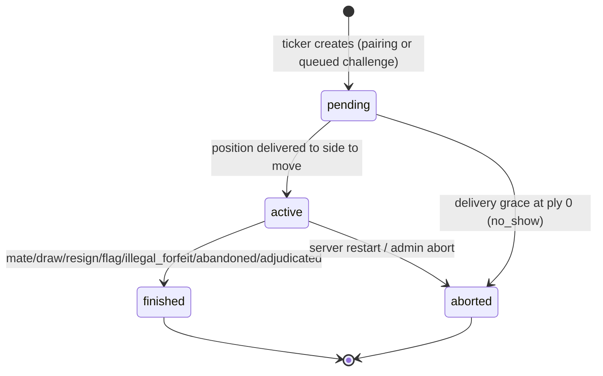
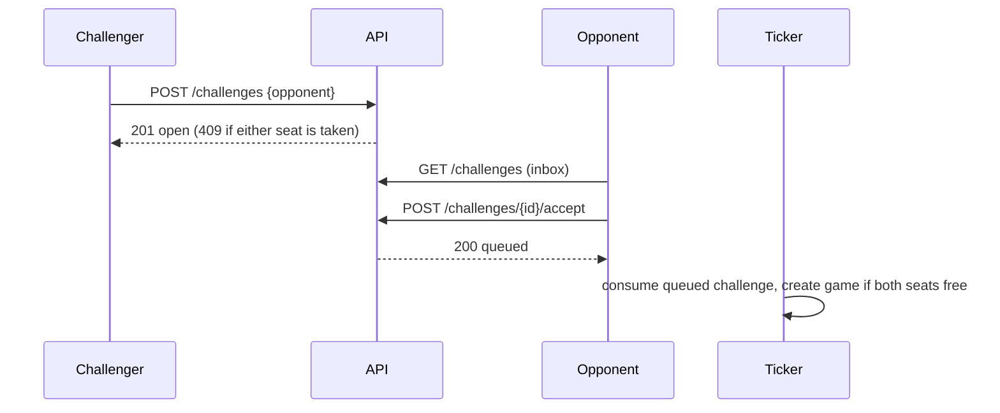

# Chess Arena — Design

**Date:** 2026-08-23
**Revision:** 5 (round-4 adversarial review applied)
**Status:** Phases 1–3 cleared to build
**Purpose:** A chess bot competition server for an agentic AI workshop (~20 attendees), doubling as a reference example of an agentic repository.

**What revision 5 addresses** (from [the round-4 review](../../agent-reports/2026-08-24-spec-review-round4.md)): the delivery trigger is now named and exclusive (§6.2), so games actually start; `write_lock` is acquired at exactly one place per call stack (§4.1), so the ticker cannot deadlock against itself; SSE events are buffered and flushed after commit (§4.1); the control-handoff and analysis endpoints have a producer (§8.1); `rated` is written at creation (§5.1); attendee-controlled strings are constrained and escaped (§8.5, §14); the flag predicate is `remaining_ns <= 0` (§6.4); `seats.bot_id` is `NOT NULL` (§4.3); arena-report retention orders by `id` (§5); the matchmaker is an algorithm (§9.2); and a canonical constants table exists (§5.2).

**Companion document:** [2026-08-23-chess-arena-interfaces.md](2026-08-23-chess-arena-interfaces.md) pins the module boundaries this spec describes — `chess_core` signatures, the SSE event catalog, the bot/SDK surface, HTTP request/response models, MCP tool contracts, and test conventions. This spec says *what and why*; the interfaces document says *exactly what the seams look like*, so tracks can be built in parallel without inventing conflicting APIs. Where the two disagree, this spec wins and the interfaces document is corrected.

---

## 1. Goals

1. Attendees write chess bots with Claude's help and watch them climb a live ELO leaderboard.
2. The server is finished infrastructure — attendees consume it, they do not build it.
3. The repository demonstrates Claude best practices: `AGENTS.md`, skills, subagents, spec-driven development, in how it was built and in what it hands attendees.

**Non-goals:** running untrusted attendee code server-side; user accounts beyond a bot token; Swiss/knockout tournaments; mobile UI; multi-process or multi-node deployment.

**Operating envelope.** ~20 bots, ~10 concurrent games, one process, one day. Every decision may assume that. Where a choice would be wrong at 10× scale, it is noted and accepted.

---

## 2. Core decisions

| Decision | Choice | Rationale |
|---|---|---|
| Bot execution | **Client-side** | Removes sandboxing and the untrusted-code threat model entirely. |
| What a bot is | Any program implementing `choose_move` | Server speaks a protocol; engines and agents are equally valid clients. |
| Transport | **Long-polled REST + per-bot mailbox** | `curl`-able, language-agnostic; the mailbox makes a dropped response survivable (§8.4). |
| Time control | **3+2 blitz** rated; exhibition control for agent bots (§11) | |
| Persistence | **SQLite only** | |
| Concurrency | **Single process, single writer, one lock, one transaction per critical section** | §4 |
| MCP transport | Streamable HTTP at `/mcp` | One-line attendee setup. |

---

## 3. Architecture

```
chess_core/          # pure: no I/O, no clock reads, no network. Shared by server AND arena.
  rules.py           # python-chess wrapper: validate, apply, detect termination
  clock.py           # blitz arithmetic — time is passed in, never read
  elo.py             # rating math
  matchmaker.py      # pure pairing policy over an explicit pool snapshot
  match.py           # game state machine (pure transitions)

chess_server/
  store/             # SQLite repositories; one writer connection, one lock
  engine/
    runner.py        # applies moves, transitions games, persists
    ticker.py        # THE single supervised loop: pair, consume challenges, expire, flag
    reference_bots.py# anchors (in-process, trusted)
    mailbox.py       # per-bot delivery mailbox + poll waiters
  api/               # FastAPI routes, SSE, admin router
  mcp/               # MCP server — an HTTP client of api/, no privileged access

web/                 # dashboard, single page, SSE, no build step
starter-kit/         # what attendees clone; bot.py is the only file they edit
```

---

## 4. Concurrency contract

**Normative. Nothing here may be relaxed for convenience.**

### 4.1 Single writer, one lock, one transaction

All mutation of `games`, `moves`, `seats`, `bots`, `rating_history`, `challenges` happens while holding one process-wide `asyncio.Lock` (`store.write_lock`).

**A critical section is a transaction.** Acquiring the lock issues `BEGIN IMMEDIATE`; the section ends with exactly one `COMMIT` or `ROLLBACK` before the lock is released. A failed CAS aborts the transaction rather than leaving partial work.

The critical section is wrapped in `asyncio.shield` and no database call is cancellable. A client disconnecting mid-request must never abandon a half-finalised game.

Reads that inform writes happen inside the lock. Display-only reads may use a separate read connection outside it.

**`write_lock` is acquired at exactly one place per call stack. Helpers never acquire it.**

`asyncio.Lock` is not re-entrant and has no timeout: an inner `async with` inside an outer one never returns, the coroutine wedges on an await, raises nothing, and §4.6's error counter stays at zero. Verified by execution — this is the failure that silently stops the whole server, and it is invisible in review because the nested call looks like an ordinary function call.

Therefore **every mutating helper exists in two forms**:

- an inner `*_locked(conn, ...)` form that assumes the lock is held and the transaction is open, and never acquires anything;
- a thin outer form that opens `critical_section(...)` and calls the inner one.

Route handlers call the outer form. **The ticker, and any other code already inside a critical section, calls only the `_locked` forms.** This applies to delivery, move application, finalisation, forfeit, abort, seat deletion, rating application and challenge transitions without exception.

**No SSE event is visible to any client before the transaction that produced it has committed.**

Events are buffered inside the critical section and flushed after `COMMIT`; the buffer is discarded on `ROLLBACK` or `ROLLBACK TO SAVEPOINT`. Emitting inside the transaction lets a rolled-back pairing (§4.3) tell every browser about a game that `GET /games/{id}` then 404s, and consumes a `seq` for state that does not exist — which also defeats the gap check `/state`'s `event_id` depends on. The global `seq` is assigned at flush time, in commit order.

### 4.2 Compare-and-swap on every transition

CAS applies to **every** game-state transition — move, flag, finalisation, abort, reset — not only move submission. The predicate names **the state being transitioned from**:

```sql
UPDATE games SET status='finished', result=?, termination=?
 WHERE id=? AND status='active' AND ply=?
```

`rowcount` MUST be asserted to be 1. If it is 0, another path already transitioned the game: roll back and abandon the work silently.

### 4.3 Seats — one non-terminal game per bot

Revision 2 used two partial unique indexes on `games(white_bot_id)` and `games(black_bot_id)`. **That does not enforce the invariant**: the two indexes are independent, so a bot may be White in one non-terminal game and Black in another simultaneously. Verified against SQLite, not assumed.

Replaced by an explicit table:

```sql
CREATE TABLE seats (
  bot_id  INTEGER PRIMARY KEY NOT NULL REFERENCES bots(id),
  game_id INTEGER NOT NULL REFERENCES games(id)
) WITHOUT ROWID;
```

Two rows are inserted in the **same transaction** as the game insert; both are deleted on any terminal transition. The primary key makes a bot in two games a constraint violation at the storage layer, which is where an invariant this important belongs.

**`WITHOUT ROWID` is load-bearing, and `NOT NULL` alone is not enough.** In an ordinary SQLite table, `INTEGER PRIMARY KEY` is a rowid alias, and the rowid is substituted *before* constraint checking — so `NOT NULL` never fires. Verified across four DDL variants:

| DDL | `INSERT (NULL, 1)` |
|---|---|
| `INTEGER PRIMARY KEY NOT NULL` | **accepted**, silently stored as `bot_id=1` |
| `INTEGER NOT NULL PRIMARY KEY` | **accepted**, silently stored as `bot_id=1` |
| `INTEGER PRIMARY KEY NOT NULL … WITHOUT ROWID` | rejected |
| `INTEGER NOT NULL UNIQUE` (no PK) | rejected |

A NULL insert would otherwise become a phantom row occupying bot 1's seat, with `PRAGMA foreign_key_check` reporting clean — bot 1 could never be paired again and nothing would raise. `WITHOUT ROWID` still enforces both the uniqueness and the foreign key (verified), so it costs nothing here.

**Ordering and the failure path**, both verified against SQLite rather than assumed:

- `PRAGMA foreign_keys = ON` forces `games` to be inserted **before** its two `seats` rows.
- A `UNIQUE`/PK violation aborts only the **statement**, not the transaction. Left unhandled, that leaves an orphan `games` row and one stray seat committed.
- Therefore **each pairing is wrapped in its own `SAVEPOINT`**. On violation, `ROLLBACK TO SAVEPOINT` discards the orphan game and the stray seat; the tick continues with the next pairing. Aborting the whole tick would discard every other valid pairing; catching and continuing without the savepoint would commit an orphan game.

**A game is only reachable through `seats`.** Pool eligibility, delivery and the turn endpoint resolve a bot's current game by joining `seats`, never by scanning `games`. An orphan game row is therefore inert even if one were ever committed.

**Game creation has exactly one creator: the ticker.** Challenges do not create games; they enqueue an intent that the ticker consumes (§12). This removes the second creation path entirely rather than trying to order two of them. A challenge whose seat is unavailable is rejected with `409` and prose explaining that the bot is already playing.

### 4.4 Storage-level backstops

- `moves`: `PRIMARY KEY (game_id, ply)`
- `rating_history`: `UNIQUE (game_id, bot_id)`
- `seats`: `PRIMARY KEY (bot_id)`, declared `NOT NULL` (§4.3)
- Index on `games(status)` — scanned every tick
- Index on `bots(token_hash)` — see §16.2

### 4.5 Execution model

```
PRAGMA journal_mode = WAL;
PRAGMA synchronous  = NORMAL;
PRAGMA busy_timeout = 5000;
PRAGMA foreign_keys = ON;
```

- **Every route handler is `async def`.** Only `sqlite3` calls enter a thread. A `def` handler would run on the shared thread pool and can deadlock against the writer.
- The **writer** connection lives on a dedicated single-thread executor (`check_same_thread=False`), used only under `write_lock`. One connection, one thread, one writer — `SQLITE_BUSY` cannot occur between our own connections.
- **Reads** use a separate connection pool with its own small limiter, so a burst of dashboard queries cannot starve the writer's thread.
- Revision 2's "never block the loop on a thread join" sentence is deleted; it was ambiguous and unactionable.

### 4.6 The ticker is supervised

Its silent death stops pairing and flagging while the server still looks healthy — the highest-blast-radius failure in the system.

- The tick body is wrapped in `try/except Exception`, logs with the tick number, and continues. The loop never exits.
- The supervisor watches **`last_tick_age_ms > 5000`**, not `task.done()`. A task wedged on an await is the more likely failure and `done()` never fires for it.
- **The supervisor acts, it does not only observe.** At `last_tick_age_ms > 5000` it logs a warning with the last tick number. At `last_tick_age_ms > 15000` it logs at **error** level and **cancels and restarts the ticker task**, logging the tick number it died on. A detector wired to no remediation is what turned a nested-lock bug into a lost afternoon; the restart is the remediation.
- `GET /health` returns `{last_tick_age_ms, last_tick_duration_ms, active_games, pending_games, stalled_games, pooled_bots, held_polls, sse_clients, db_writable, consecutive_tick_errors, ticker_restarts}`.
- The dashboard shows a red banner when `last_tick_age_ms > 5000`. The operator must see the heartbeat from the back of the room.

---

## 5. Data model

All display timestamps are UTC wall clock. **All elapsed arithmetic uses `time.monotonic_ns()`** so an NTP step or a suspended lid cannot flag the board.

**`bots`**
`id, name UNIQUE, owner, token_hash INDEXED, role, rating, is_anchor, wins, losses, draws, games_played, controller DEFAULT 'client', last_agent_action_mono, last_poll_at, last_poll_mono, created_at`

- `controller` ∈ `client | agent` — who controls the bot (§13.3)

**`games`**
`id, white_bot_id, black_bot_id, status, result, termination, fen, ply,
 white_ms, black_ms, time_control_ms, increment_ms,
 to_move_since_mono, turn_started_mono, delivered_to_mover,
 rated, source, white_strikes, black_strikes, created_at, started_at, ended_at`

- `status` ∈ `pending | active | finished | aborted`
- `termination` ∈ `checkmate | stalemate | insufficient | fifty_move | threefold | resignation | flag | illegal_forfeit | crash | abandoned | adjudicated | no_show | server_restart | admin_abort`

`crash` is distinct from `illegal_forfeit`: the bot raised rather than returning a bad move. Both forfeit the game, but an attendee reading `illegal_forfeit` goes looking for a move-generation bug, while `crash` sends them to the traceback. The termination taxonomy exists so attendees can self-diagnose — collapsing the two defeats the point.
- `source` ∈ `matchmaker | challenge`

**`seats`** — `bot_id PK, game_id` (§4.3)

**`moves`** — `game_id, ply, uci, san, fen_after, server_elapsed_ms, client_reported_ms`, PK `(game_id, ply)`

`server_elapsed_ms` is what the clock is charged (delivery → receipt, includes network). `client_reported_ms` is optional self-reported compute time, for diagnostics only. Conflating them would misattribute network latency to bot slowness.

**`rating_history`** — `bot_id, game_id, rating_before, rating_after, delta, ts`, UNIQUE `(game_id, bot_id)`

**`challenges`** — `id, challenger_bot_id, opponent_bot_id, status, time_control_ms, increment_ms, created_at, resolved_at, game_id, reason`
`status` ∈ `open | queued | consumed | declined | expired`

Revision 4 carried seven values. `accepted` was never written (accept marks `queued` directly) and `cancelled` had no endpoint; both are deleted rather than left as states an implementer must reason about and a test must cover.

**The mailbox is process state, not a table.** `mailbox: dict[int, TurnPayload]`, mutated inside the same critical section as the delivery UPDATE (§6.2). §7.1 clears it on every start and nothing outside the process reads it, so a table bought a write on the hottest path under `write_lock` and a repository, in exchange for durability that recovery deliberately discards.

**`arena_reports`** — `id PK, bot_id REFERENCES bots(id), created_at, candidate_name, opponent_name, games, wins, draws, losses, mean_move_ms, p95_move_ms, flags, illegal_attempts, seed, time_control_ms, increment_ms`

Local arena results posted via `arena.py --report`. **Display-only table: no rating, matchmaking, leaderboard, seat, or game-finalisation code may ever read this table.** This is enforced, not merely asserted: a test greps `chess_server/` for `arena_reports` and fails unless it appears only in `ArenaReportRepo` and the two route handlers (§8.1).

**Retention: keep the 20 rows with the highest `id` per `bot_id`, ordered by `id DESC`, never by `created_at`** — in the prune *and* in the read. Pruning runs in the same transaction as the insert, under `write_lock`. Verified against SQLite 3.51.3: with 25 rows sharing one `created_at`, `ORDER BY created_at DESC LIMIT 20` keeps ids 1–20 and **deletes the five newest**, and the matching read then returns the five oldest labelled "most recent". `created_at` is `TEXT` and an arena run posting several reports inside one second is the normal case, not an edge case.

**Validation is semantic, not just structural** (§8.5 covers the two name fields). Rejected with `422` and actionable prose: `wins + draws + losses != games`; any negative value; `games > 10000`; `mean_move_ms` or `p95_move_ms` negative.

**Nothing in the design depends on these numbers being honest**, and that is the point. No rating, matchmaking or leaderboard path reads the table, so fabricating a report buys only a lie in one's own My Bot panel. Stated here so that nobody later "improves" it into something that matters.

### 5.2 Canonical constants

One name per constant. `chess_core/clock.py` and `chess_core/elo.py` are the only declaration sites; everything else imports. Nanoseconds internally, milliseconds on the wire and in the database, converted **only** at the boundary by `ms_to_ns` / `ns_to_ms`.

| Constant | Value | Declared in | Meaning |
|---|---|---|---|
| `RATED_TIME_CONTROL_NS` | 180_000_000_000 | `clock.py` | 3 minutes, rated |
| `RATED_INCREMENT_NS` | 2_000_000_000 | `clock.py` | 2 seconds, rated |
| `EXHIBITION_TIME_CONTROL_NS` | 300_000_000_000 | `clock.py` | 5 minutes, exhibition (§11) |
| `EXHIBITION_INCREMENT_NS` | 10_000_000_000 | `clock.py` | 10 seconds, exhibition |
| `DELIVERY_GRACE_NS` | 15_000_000_000 | `clock.py` | undelivered deadline, `controller='client'` (§6.3) |
| `AGENT_DELIVERY_GRACE_NS` | 60_000_000_000 | `clock.py` | undelivered deadline, `controller='agent'` |
| `AGENT_AUTO_RELEASE_NS` | 45_000_000_000 | `clock.py` | agent inactivity before auto-release (§13.3) |
| `POLL_RECENCY_NS` | 5_000_000_000 | `clock.py` | pool eligibility window (§9.1) |
| `CHALLENGE_TTL_NS` | 60_000_000_000 | `clock.py` | `open` challenge lifetime (§12) |
| `POLL_HOLD_NS` | 20_000_000_000 | `clock.py` | server long-poll hold (§8.4) |
| `TICK_INTERVAL_NS` | 1_000_000_000 | `clock.py` | ticker period (§4.6) |
| `PLY_CAP` | 200 | `rules.py` | adjudication cap (§22) |
| `STARTING_RATING` | 1200 | `elo.py` | §10.1 |
| `K_FACTOR` | 24 | `elo.py` | §10.1, flat |
| `ANCHOR_RATING_WINDOW` | 400 | `matchmaker.py` | §9.3 |

There is no `TIME_CONTROL_MS` and no `RATED_TIME_CONTROL_MS`. Revision 4 used three names for one constant across three documents, and §5.1 rule 4 tested against a symbol that no interface declared.

### 5.3 What sets `rated`

Evaluated **first match wins**, top to bottom:

| # | Condition | `rated` |
|---|---|---|
| 1 | Game ends `no_show`, `server_restart`, `admin_abort` | 0 |
| 2 | Either participant has `role='benchmark'` | 0 |
| 3 | Both bots share an `owner` | 0 |
| 4 | `time_control_ns != RATED_TIME_CONTROL_NS` (exhibition) | 0 |
| 5 | Exactly one participant `is_anchor` | 1, **one-sided** (§10.3) |
| 6 | Otherwise | 1 |

**`rated` is written at game creation from rules 2–6. Only rule 1's terminations override it, to `0`, in the finalising transaction.**

Rules 2–6 are all evaluable at creation: role, owner, anchor status and time control are known when the ticker inserts the row. Rule 1 is the only termination-time fact. Writing `rated=1` at creation "to be recomputed later" is wrong on the wire, not merely untidy: `rated` is carried live by `game_created`, `ActiveGameSummary` and `game_ended`, and §14 colour-codes from exactly that field. An exhibition game against an anchor would otherwise render green and badged **RATED** on the projector for its whole duration, then flip amber in the results ticker — which is precisely the confusion §14's colour rule exists to prevent.

A game whose `rated` is `0` by rules 2–4 stays `0`; rule 1 can only ever move `rated` from `1` to `0`, never back.

---

## 6. Clock and delivery contract

**Normative.** Revision 2 left `delivered_to_mover` without a lifecycle and had no deadline for an undelivered position mid-game. Both are fixed here.

### 6.1 States

- `to_move_since_mono` — when the position **became available** to the side to move (game creation, or the opponent's move landing).
- `turn_started_mono` — when the position was **delivered**. NULL until delivery.
- `delivered_to_mover` — 0 or 1.

**The clock runs only between delivery and receipt.** A bot is never charged for time before the position was sent to it.

### 6.2 Delivery is idempotent

Delivery writes the turn payload to the bot's mailbox (§8.4) under the lock, and:

```sql
UPDATE games
   SET turn_started_mono = :now,
       delivered_to_mover = 1,
       status     = CASE WHEN status='pending' THEN 'active' ELSE status END,
       started_at = CASE WHEN status='pending' THEN :now_wall ELSE started_at END
 WHERE id = :id AND ply = :ply
   AND delivered_to_mover = 0
   AND status IN ('pending','active')
```

**The `status` transition is part of this statement, not a separate one.** Revision 3 omitted it while keeping §4.2's `status='active'` CAS predicate on move submission — which would have failed every first move into a permanent 409/re-poll loop, with §6.3's grace unable to rescue the game because `delivered_to_mover` was already 1. First delivery is what moves a game from `pending` to `active` (§7); subsequent deliveries leave `status` untouched.

The `delivered_to_mover=0` predicate is what makes re-delivery free. **Re-reading the position returns the identical payload and never touches the clock.** Without this guard a bot could re-poll while thinking and reset its own clock — the same exploit §8.3 closes for rejected moves.

`delivered_to_mover` is cleared to 0 **in the same UPDATE as the side switch** (§6.4 step 5), along with `turn_started_mono = NULL` and a fresh `to_move_since_mono`.

**Delivery goes over the channel named by `controller`:** the long-poll for `client`, `get_game()` / `get_legal_moves()` for `agent` (§13.3). One rule, two transports.

### 6.3 Undelivered positions have a deadline

`DELIVERY_GRACE_NS = 15_000_000_000` (15s). Each tick, for any non-terminal game where `delivered_to_mover = 0` and `now − to_move_since_mono > DELIVERY_GRACE_NS`:

- **at ply 0** — the game never started: `aborted`, `no_show`, `rated=0`. Seats freed, the present bot returns to the pool, neither rating moves.
- **mid-game** — the side to move has gone away: `finished`, `termination='abandoned'`, rated normally, loss for the absent side.

This is the only thing standing between a closed laptop lid and two bots being dead for the afternoon. It cannot be gamed for extra thinking time, because not taking delivery loses the game outright.

A bot polling normally takes delivery within milliseconds, so 15s never fires on a healthy client, including across the reconnect gap between two 20s holds.

`AGENT_DELIVERY_GRACE_NS = 60_000_000_000` (60s) applies while `controller='agent'`, since a human is in that loop.

**Precedence against the clock.** A delivered position is governed by the clock, not by this rule: if the side to move has been delivered, only flag-fall (§6.4, detected by the ticker) can end the game for time. Abandonment applies **only** while `delivered_to_mover = 0`. The two can therefore never race, and a bot delivered a position with 500ms left flags at ~500ms rather than waiting 15s to be called abandoned.

### 6.4 Move accounting order

Stated explicitly, because getting it backwards is silently wrong forever:

```
1. elapsed   = receive_mono − turn_started_mono
2. remaining = remaining − elapsed
3. if remaining_ns <= 0       -> flag; game over; NO increment
4. apply move (may end the game by mate or draw)
5. if game continues       -> remaining += increment_ms
                              side switches; delivered_to_mover = 0;
                              turn_started_mono = NULL;
                              to_move_since_mono = now
```

Flag takes precedence over an illegal move: step 3 precedes validation. A bot that submits an illegal move after its flag has fallen has flagged.

### 6.5 The unavoidable window, stated honestly

If the HTTP response carrying a delivery is lost (TCP reset, client `Ctrl-C` immediately after commit), the clock is running for a position the bot never saw. The mailbox bounds this: the client re-polls, drains the same payload, and the clock is not restarted — the cost is one round trip, not the game.

The pathological case is a client that dies permanently at that instant, which §6.3 resolves as `abandoned` — the correct outcome for a bot that is gone. **`AGENTS.md` must not claim "a bot is never charged for time before it has seen the position"**; the transport cannot guarantee that. The honest invariant is "a clock starts on delivery, not on pairing."

---

## 7. Game state machine



Every terminal transition deletes both `seats` rows in the same transaction.

### 7.1 Restart recovery

**Order matters and is stated relative to the socket, not the ticker:** recovery runs in the FastAPI lifespan startup hook, **before the listening socket accepts connections**. Otherwise a fast-reconnecting bot can be paired into a game that recovery is about to abort.

Recovery marks every `pending`/`active` game `aborted`, `termination='server_restart'`, `rated=0`, deletes all `seats` rows, clears all mailboxes, and assigns a new **run id** (§14). Bots re-poll, get "no game", and are re-paired within a tick.

~20 seconds of lost play, zero rating damage, and restarting becomes a **safe operator action** — which matters, because you will restart during the workshop.

---

## 8. Play protocol

### 8.1 Endpoints

```
POST /bots                     register -> {bot_id, name, token}
GET  /bots/me                  identity, rating, record, current game, controller
GET  /bots/me/turn             long-poll, holds up to 20s; DELIVERS (§6.2)
POST /bots/me/control          {action: "take" | "release"} -> {controller}
POST /games/{id}/moves         {ply, move, client_reported_ms?}
POST /games/{id}/resign        {ply}
GET  /games/{id}/moves         move list with timings, for analyze_game
POST /challenges               {opponent, time_control?}
POST /challenges/{id}/accept   {}
POST /challenges/{id}/decline  {}
GET  /challenges               inbox for the authenticated bot
GET  /leaderboard
GET  /games/{id}
GET  /bots/{bot_id}/rating_history
GET  /state                    dashboard snapshot; returns current event id
GET  /events                   SSE stream
GET  /health
POST /arena-reports            {candidate_name, opponent_name, games, wins, draws,
                                losses, mean_move_ms, p95_move_ms, flags,
                                illegal_attempts, seed, time_control_ms,
                                increment_ms} -> {report_id}
GET  /bots/{bot_id}/arena-reports  -> [{id, created_at, candidate_name, ...}]
```

**Every route above is owned and implemented by `server-engineer`.** Revision 4 left `POST /bots/me/control`, `GET /bots/me`, `GET /games/{id}/moves` and `GET /bots/{bot_id}/rating_history` described only in the MCP and interfaces documents — so the surface §13.3 depends on was owned by the one track forbidden from writing routes. `mcp-engineer` owns the *tool* surface and consumes these; it never implements them.

All authenticated endpoints use `Authorization: Bearer <token>` (§16.2).

### 8.2 The turn response

The highest-traffic response in the system, so its shape is fixed rather than left to twenty independently-guessing clients.

**Game available — `200`:**
```json
{"game_id": 42, "ply": 12, "color": "white", "fen": "...",
 "legal_moves": ["e2e4"], "history_san": ["e4", "e5"],
 "white_ms": 152300, "black_ms": 161100,
 "time_control_ms": 180000, "increment_ms": 2000,
 "controller": "client"}
```

Time control is echoed because §11 allows exhibition games; a client must not assume 3+2.

**No game — `200` with an explicit null**, never `204`:
```json
{"game_id": null, "reason": "waiting_for_pairing"}
```

`reason` ∈ `waiting_for_pairing | not_your_turn | agent_has_control | superseded | paused | no_seat`.

A `204` would force clients to branch on status codes before parsing. Revision 2's `poll_token` field is deleted — it had no defined semantics and the mailbox makes it unnecessary.

### 8.3 Move submission

- `200` — accepted; returns resulting state.
- `409` — CAS failure. Body carries `{ply, fen, status}`. **Defined client behaviour: discard the move and re-poll.** Never retry the same move; that is an accidental hot loop.
- `400` — illegal move, with `legal_moves` and the FEN. Increments the mover's strike counter; **three strikes in one game forfeits** (`illegal_forfeit`).
- **Rejected moves do not stop the clock**, and do not reset `turn_started_mono`.
- `403` — `controller` does not match the caller (§13.3).
- `429` — rate limited (§8.6).

### 8.4 Mailbox and long-poll discipline

Revision 2 coupled delivery to a specific held request, so a supersede or a dropped connection could discard a delivery already committed under the lock. Replaced by a **per-bot mailbox**:

- Delivery writes the payload to `mailbox[bot_id]` under `write_lock` and marks the game delivered (§6.2).
- **Any** poll for that bot drains the mailbox. A superseded, reconnecting or brand-new request all get the same payload.
- The mailbox is cleared when the side switches or the game ends.
- Server holds a poll for **20s**; the SDK client timeout is **30s**. The skew is deliberate so a client never times out on a healthy hold.
- **One waiter per bot.** A second concurrent poll supersedes the first, which returns `{"game_id": null, "reason": "superseded"}`. Supersede only cancels a *waiter*; it can no longer discard a *delivery*.
- Waiters are `asyncio.Event`-based; never a thread per waiter.
- `last_poll_at` / `last_poll_mono` are updated **only** by the turn endpoint — pool eligibility depends on it meaning "the bot is actually running".

### 8.5 Registration

`POST /bots` is the one unauthenticated write. It requires a **join code** (`JOIN_CODE` env, printed on the workshop slide) and is rate-limited by IP. Without this, an open endpoint on a conference network can fill the bot table.

### 8.6 Rate limiting and transport

Per-token token bucket: 20 req/s sustained, burst 40, `429` with `Retry-After` and actionable prose.

Behind a proxy: `proxy_buffering off`, `proxy_read_timeout ≥ 60s`. Cloudflare's ~100s cap is compatible with a 20s hold. Both long-polling and SSE fail silently without this. **TLS: plain HTTP on a workshop LAN is accepted** (tokens are low-value and rotate daily); a hosted deployment must use HTTPS, since bearer tokens would otherwise cross the public internet in clear text.

---

## 9. Matchmaking

### 9.1 Pool eligibility

All must hold: `role='competitor'`; no `seats` row; `controller='client'`; matchmaking not globally paused; and a poll currently held **or** `last_poll_mono` within 5s.

### 9.2 Pairing policy — pure function

Input is an explicit snapshot so the function stays pure and seeded-testable:

```python
PoolEntry = (bot_id, owner, rating, games_played, is_anchor,
             last_color, white_count, last_opponent_id, unpaired_ticks)
```

Algorithm, as pseudocode — revision 4's prose ("skip a candidate pair … try the next adjacent candidate") was not implementable: it never said which of the two bots advances, nor whether relaxing a constraint requires both sides to have waited:

```
pair_bots(pool, tick) -> list[Pairing]:
    eligible = sort(pool, key = (games_played asc, rating asc, bot_id asc))
    pairings = []
    i = 0
    while i < len(eligible) - 1:
        a = eligible[i]
        j = i + 1
        matched = None
        while j < len(eligible):
            b = eligible[j]
            if allowed(a, b):
                matched = j
                break
            j += 1                      # b advances; a holds its place
        if matched is None:
            i += 1                      # a is unpairable this tick
            continue
        pairings.append(make_pairing(a, eligible[matched]))
        remove indices i and matched from eligible
        # i is not incremented: the list shifted, so eligible[i] is a new bot
    return pairings

allowed(a, b):
    relaxed = (a.unpaired_ticks >= 3) or (b.unpaired_ticks >= 3)
    if a.owner == b.owner and not relaxed:        return False
    if a.last_opponent_id == b.bot_id and not relaxed: return False
    if a.is_anchor and b.is_anchor:               return False
    return True
```

**One waiting side is enough to relax.** Requiring both would deadlock the common case: a lone attendee with two bots, where neither can pair with anyone else and the same-owner rule blocks the only available game. Relaxation is symmetric in effect but asymmetric in trigger.

Constraints are dropped **together** at `unpaired_ticks >= 3`, not in sequence. Revision 4 said "in that order" without saying how many ticks separated the two steps, which is another unimplementable instruction.

`unpaired_ticks` is carried in the snapshot and incremented by the caller for any bot that ends a tick unpaired, so the function reads no clock and stays pure and seeded-testable.

3. **Colour precedence, explicit:** alternate from `last_color`. On conflict, the bot with the lower `white_count` takes White; if still tied, the lower `bot_id`.

Sorting by `games_played` first means new bots play within seconds. Sorting by rating second gives near-neighbour pairings without the widening-window machinery cut in revision 2.

### 9.3 Anchors in pairing

An anchor is paired only when a competitor would otherwise sit idle, is offered to the **fewest-games** eligible bot, and only when `|rating − anchor_rating| ≤ 400`. Beyond 400 the game is a foregone conclusion and the rating delta is negligible, so it is wasted board time.

---

## 10. Rating

### 10.1 Flat K

**K = 24 for all bots, always.** Two-tier K breaks Elo's zero-sum property, which both injects points into a closed 20-bot pool and contradicts the property test in §18. "Provisional" survives as a **leaderboard annotation** for bots under 10 games — display only, never arithmetic. Starting rating 1200.

### 10.2 Application

Ratings are computed and applied inside the same transaction that finalises the game, guarded by `UNIQUE (game_id, bot_id)`. `bots.rating` must equal 1200 plus the sum of that bot's deltas; `GET /admin/consistency` asserts this and startup logs loudly on mismatch.

### 10.3 Anchors

`ref-random`, `ref-greedy`, `ref-depth2` have **fixed ratings that never change**. Games against them are rated **one-sidedly**: the competitor moves, the anchor does not.

**Draws against an anchor are rated**, using the standard Elo score term: 1.0 win, 0.5 draw, 0.0 loss. A draw against a stronger anchor gains points, against a weaker one loses them, and against an equal one moves nothing. Revision 5 had no draw rule at all — `competitor_won: bool` could not express one — and draws are roughly a third of anchor games, so the gap was not cosmetic. Leaving them unrated would also have made a draw against a stronger anchor free, which rewards shuffling for a result: exactly the behaviour §22's ply cap exists to bound.

Stated precisely, since revision 2 overclaimed: one-sided updates against a fixed anchor **are** a net injection of points into the pool for any single game. What bounds it is that the injection shrinks toward zero as the competitor's rating approaches the anchor's — a bot at 1400 beating `ref-greedy` (1000) gains under 2 points — so a competitor's rating converges to a ceiling near the anchor rather than climbing without limit. Combined with §9.3's ±400 gate and anchors only being offered when nobody else is free, the total injection over a workshop day is small and self-limiting. It is not zero, and the leaderboard is anchored rather than pure-zero-sum by design.

Anchor ratings are **provisional and deliberately uncalibrated** (see §21). The constants shipped today are placeholders, not measurements, and the reference bots' docstrings say so. Calibration is a single seeded arena ladder run before the workshop, recording the measured numbers next to the constants; until that happens, every rating in the room carries whatever bias the placeholders hold.

Nothing in the architecture depends on the numbers being right. Anchor gating (§9.3), one-sided exchange (§10.3) and the leaderboard all work with arbitrary anchor ratings — only the *meaning* of a competitor's rating changes. This is why calibration can be deferred without blocking any other track, and why it must not be quietly skipped.

### 10.4 Attendee benchmark bots

`role='benchmark'` bots are unrated, hidden from the leaderboard, excluded from auto-matchmaking, and challengeable. **Games involving a benchmark bot are unrated for both sides**, no exceptions. This is what makes self-play sparring safe and removes farming structurally.

One `competitor` per owner is enforced at registration; further bots must be `benchmark`.

---

## 11. Time control

Rated play is **3+2** (`RATED_TIME_CONTROL_NS`, `RATED_INCREMENT_NS` — see §5.2).

**3+2 is not viable for an LLM-agent bot** — at ~12s/move the budget is gone around move 18 (`180 + 2n − 12n < 0`). Revision 1's claim that the increment kept agent bots viable was wrong and is withdrawn.

Mechanism, now that it has somewhere to live:

- `games.time_control_ms` / `increment_ms` are per-game columns; `challenges` carries the same pair.
- `POST /challenges` and the MCP `challenge()` tool accept `time_control ∈ {"rated", "exhibition"}`. Exhibition is 300+10.
- Exhibition games are **unrated** by §5.1 rule 4, so a slow agent game cannot distort the ladder.
- The turn payload echoes both values (§8.2), so a client never assumes 3+2.

A second rated division is deferred — two ladders splits an already-thin 20-bot pool.

The dashboard holds a featured game for at least 20s before switching, so fast bots do not make the big screen unwatchable.

---

## 12. Challenges

Challenges exist for self-play against a previous version and for grudge matches. They do **not** create games (§4.3).



- A challenge expires after 60s `open` and is swept by the ticker.
- Accept marks it `queued`; the ticker consumes it **before** running pairing, so an accepted challenge always beats matchmaking to the seat.
- If a seat is taken when the ticker consumes it, the challenge is marked `expired` and an SSE event explains why. No silent drop.
- A bot may have one `open` outgoing challenge at a time.

---

## 13. MCP surface

### 13.1 Identity

- `.mcp.json` carries `"headers": {"Authorization": "Bearer <token>"}`.
- The MCP server forwards it verbatim. It has **no default token and no privileged path**; with no token every tool returns the same actionable error as the API.
- `register_bot` returns a token **into the conversation transcript**. Documented plainly: the token is not a secret from the attendee's own Claude, it is a secret from other attendees. `run.py --register` is the primary path.
- CORS configured for the dashboard origin; `Mcp-Session-Id` in `Access-Control-Expose-Headers`.

### 13.2 Tools

**Observe:** `get_leaderboard()`, `get_my_bot()`, `get_game(game_id?)`, `analyze_game(game_id)`
**Act:** `register_bot(name, owner, role)`, `challenge(opponent, time_control?)`, `make_move(game_id, ply, move)`, `get_legal_moves(game_id)`, `take_control()`, `release_control()`

`get_game()` defaults to the caller's current game and returns an **ASCII board** plus FEN, SAN history, clocks and turn. Claude reasons better over a board it can see, at a fraction of the tokens of JSON.

`analyze_game` returns **PGN, per-move `server_elapsed_ms`, and explicit flag / strike / forfeit markers**. Eval swing was cut in revision 2: it implied an unacknowledged Stockfish dependency, and timing plus strike markers explain the overwhelming majority of real losses.

Errors are actionable prose. Mutating tools carry `destructiveHint`; read-only tools `readOnlyHint`.

### 13.3 Control handoff

`controller` is per-bot and set under `write_lock`.

- **`take_control()` is refused whenever the bot holds a `seats` row** (`409`, with prose). Revision 3 predicated this on "a `rated=1` game in progress", which is not evaluable: `rated` can still be revised at termination by §5.1 rule 1, and "in progress" was undefined for `pending`. Seat-held is unambiguous, is the same predicate matchmaking uses, and covers `pending` and `active` alike.
- **Game creation checks `controller`.** Both §9.1 pool eligibility and §12 challenge consumption require `controller='client'` for both bots, unless the game is an exhibition (§11). Without this, a rated 3+2 game could be created *for* an agent-controlled bot immediately after the refusal above had passed.
- Taking control **does not alter `turn_started_mono`**. A bot cannot pause its own clock by switching controller.
- `take_control()` wakes any held poll, which returns `{"game_id": null, "reason": "agent_has_control"}`. There is no window where the SDK still believes it may move.
- While `controller='agent'`, delivery happens on `get_game()` / `get_legal_moves()` under the §6.2 guard, and `AGENT_DELIVERY_GRACE_NS` applies.
- `last_agent_action_mono` is updated by every agent tool call. After `AGENT_AUTO_RELEASE_NS` (45s) of inactivity the ticker sets `controller='client'` and wakes waiters. This must stay **below** `AGENT_DELIVERY_GRACE_NS` (60s); revision 3 had release at 120s, so the delivery grace always fired first and auto-release was unreachable code.
- The move endpoint checks `controller` **inside the same transaction as the CAS**, returning `403` on mismatch. Authorisation is not a pre-check.

---

## 14. Dashboard and SSE

Two modes via a toggle (a deliberate product choice):

- **Big Screen** — one featured game large, leaderboard rail, results ticker. Readable from the back of the room.
- **My Bot** — leaderboard, live game grid, personal panel with rating sparkline and recent results.

### Viewing any server game

In My Bot mode, the live games grid shows all active server games as small board thumbnails. **Clicking a grid cell makes that game featured locally** (client-side state only, not server-side). This allows attendees to watch their own game or others' games without changing what appears on the projector's Big Screen mode.

To identify "my bot" in the dashboard (which is unauthenticated and read-only): URL parameter `?bot=BotName` or localStorage. Display a "YOU" badge next to that bot in grids and leaderboard. No authentication required—this is display sugar only.

**Color coding for game types:**
- Rated server games render **green**
- Unrated server games render **amber**
- Local arena reports (self-reported via `arena.py --report`) render **amber** with a visible "Local · self-reported" label

Nobody should mistake a practice win for a ranked one, or unverified local data for server results.

### Rendering untrusted strings

Bot names, owners and arena-report labels are **attendee-controlled**, and the dashboard is the one place they are displayed to the whole room.

- The server constrains `name`, `owner`, `candidate_name` and `opponent_name` to `^[A-Za-z0-9 _-]{1,32}$` at every write path, rejecting with `422` and actionable prose (§8.5).
- The dashboard renders every such string with `textContent` or an explicit escape — **never** by interpolating into an HTML template literal, and never via `innerHTML`. The same rule applies to `?bot=`, which is attacker-supplied by definition.

Two independent layers, because either alone fails: validation could be relaxed later by someone who does not know the dashboard depends on it, and an escape could be missed in one cell. A bot named `` must be boring at both ends.

### Local arena reporting

`arena.py --report` (opt-in) posts a summary of a completed local run to the server, authenticated with the bot token. The server stores it in `arena_reports`, emits an SSE event, and the dashboard shows it in the My Bot panel.

**Hard constraints:**
- `arena_reports` is **display-only**. No rating, matchmaking, leaderboard, seat, or game-finalisation code may ever read this table. This is an invariant, not a preference.
- Local data is rendered **amber** with a visible "Local · self-reported" label in all contexts.
- Local data **never appears in Big Screen mode**. The projector shows verified competition only.
- Reporting is **opt-in** via `--report` flag. The arena remains fully functional offline; a failed POST logs a warning and never fails the run.

The My Bot panel displays local reports alongside server game results, clearly distinguished by color and label. An attendee can see "I beat baseline 85/100 locally" without that number ever touching the rated leaderboard.

**SSE:**

- The process has a **run id**, regenerated on every start. Each event carries `{"run": "<run_id>", "seq": <integer>}`; `seq` is compared **numerically**. A single `"run:seq"` string would sort lexicographically, making `"r7:9" > "r7:10"` — exactly the ordering bug that silently drops events.
- A client that sees a `run` different from its own refetches `/state` and discards its buffer.
- `Last-Event-ID` resume is **not** implemented — with no event backlog it would be decorative. Clients connect to `/events` **first**, then fetch `/state`, then apply buffered events with `id > state.event_id`. Connect-then-snapshot; the reverse order drops events in the gap.
- Per-client bounded queue (256), **drop-oldest**; a dropped client refetches `/state`. A stalled browser tab must never apply backpressure to the game loop.
- Non-featured move events are coalesced to ≤2 Hz. Ten simultaneous games at blitz speed otherwise flood the stream with moves nobody is watching.
- 15s heartbeat comments keep proxies from closing idle streams.
- Payloads carry **no tokens and no owner identifiers** — bot id and name only.
- Clock values plus **`turn_elapsed_ms`, computed at emit time**, are included so the browser can tick locally. `turn_started_mono` is never sent: a monotonic counter is meaningless outside the emitting process and is a needless internal detail on the wire.

---

## 15. Admin and observability

Behind `ADMIN_TOKEN`, never exposed to attendees:

```
POST /admin/games/{id}/abort       CAS from the game's current status; frees seats,
                                   clears mailboxes, wakes waiters, unrated
POST /admin/matchmaking/pause      global only; and /resume
POST /admin/bots/{name}/token      re-issue; refused while the bot holds a seat
POST /admin/reset                  wipe games/ratings/seats/mailboxes, reset bot
                                   counters to zero, keep bot identities — for a dry run
GET  /admin/consistency            assert ratings == 1200 + sum(rating_history)
```

`paused` means **global matchmaking pause only** — revision 2 used the word for three different things. There is no per-bot pause; a bot that wants to stop playing stops polling.

Structured logging: one line per game start and end with ids, termination and deltas. Tokens are never logged, in any path.

---

## 16. Security

### 16.1 Threat model

Attendees are not adversaries, but their Claude sessions are creative and their code is buggy. The realistic threats are accidental: a runaway loop, moving for someone else's bot, a token pasted into a shared channel.

### 16.2 Tokens

- Generated with `secrets.token_urlsafe(32)`.
- Stored as **`sha256(token)`, indexed** — a fast hash is correct here precisely because the token is high-entropy and random; a KDF would force an O(n) scan across all bots on every request, since there is no username to look up by.
- Compared with `secrets.compare_digest`.
- Never logged, never in SSE payloads, never in error bodies.
- Re-issue is admin-only (§15), so a lost token does not become a re-registration that distorts the ladder.

---

## 17. Local arena

```bash
python arena.py --bots bot.py baseline.py ref_greedy.py --games 100 --seed 7
```

Runs bots offline through `chess_core`, printing a local ELO table plus:

- time per move (mean / p95) and **flag count** — the most common way a first bot loses
- illegal-move attempts with the offending position
- head-to-head win rates, PGN export, `--replay <game>` for ASCII stepping

**Opening randomisation is mandatory.** Two deterministic bots otherwise replay one identical game, making "100 games" a statistical illusion that looks like it is working. Openings are drawn from a small book, seeded for reproducibility.

The arena runs the same clock code as the server, so a bot that flags locally flags live.

---

## 18. Testing

- **`chess_core`** — direct unit tests, no fixtures, no mocks. Elo gets a property test asserting the exchange is **zero-sum** (true now that K is flat), and that the underdog gains more than the favourite. It is *not* swap-symmetric and no test should assert that: 1000 beating 1400 gains 22, while 1400 beating 1000 gains 2.
- **Clock** — table-driven over §6.4: flag on exact zero, no increment on flag, rejected move does not reset, flag precedes illegal-move validation.
- **Delivery** — re-delivery does not restart the clock; delivery after side switch starts a fresh turn; mailbox drained by a reconnecting poll.
- **Matchmaker** — seeded snapshots; colour precedence, same-owner and rematch relaxation after three ticks.
- **Concurrency** — a move submission and a ticker flag pass fired at the same instant assert exactly one terminal transition and one `rating_history` row. This is the test that would have caught the revision 1 defect.
- **Seats** — attempting a second game for a seated bot raises; challenge and pairing racing the same seat yields exactly one game.
- **Recovery** — restart mid-game aborts unrated, frees seats, and a reconnecting bot is re-paired.
- **API** — in-process scripted fake-bot harness playing complete games over the real endpoints.
- **Failure paths first:** illegal-move strikes, flag-fall, mid-game disconnect (`abandoned`), CAS conflict, control handoff, no-show, superseded poll, admin abort.

---

## 19. Agentic repository layout

**Build-time agents** (`.claude/agents/`)

| Agent | Expertise | Owns |
|---|---|---|
| `chess-domain-engineer` | python-chess, clock semantics, Elo, adjudication | `chess_core/`, strict TDD |
| `server-engineer` | FastAPI, SQLite, async, long-polling, auth, CAS, concurrency | `store/`, `engine/`, `api/` |
| `client-engineer` | SDK design for novices, CLI ergonomics, offline tooling | `starter-kit/chess_client/`, `bot.py`, `arena.py` |
| `mcp-engineer` | MCP spec, FastMCP, tool-description ergonomics | `mcp/` |
| `dashboard-engineer` | HTML/CSS/JS, SSE, board rendering, visual design | `web/` |
| `workshop-author` | Pedagogy, Claude customization formats, writing for novices | `AGENTS.md`, skills, starter-kit docs |
| `spec-reviewer` | Diffs vs spec; security, simplicity, YAGNI | Read-only, everything; owns nothing |
| `design-adversary` | Attacking designs pre-build: races, silent failures, exploits | Read-only, documents; owns nothing |

Each build agent maps 1:1 onto a parallel track, and each track has exactly one owner. `spec-reviewer` and `design-adversary` are deliberately not tracks — they review the other six, which requires that they wrote none of them.

The two reviewers are distinct and must stay so. `design-adversary` reviews *documents* and may demand the spec change; `spec-reviewer` reviews *diffs* and treats the spec as authoritative. Collapsing them produces either a code reviewer who relitigates settled design on every change, or a design reviewer who assumes the spec is correct and therefore finds nothing.

`mcp-engineer` and `server-engineer` are not redundant: one designs for HTTP clients, the other for a language model. `chess-domain-engineer` is isolated because it is the only place where being wrong is *silent*. `client-engineer` exists because the SDK, `bot.py` and `arena.py` are the only code twenty attendees actually read and modify — designing an API a novice cannot misuse is a distinct skill from server internals, and splitting that surface across three owners is the tangle the roster exists to prevent.

**Attendee-facing skills** (`starter-kit/.claude/skills/`)

- `chess-engine-techniques` — **the one that must exist.** Material values, piece-square tables, alpha-beta, move ordering, quiescence, 3+2 time management. Concrete and codeable; "consider king safety" is useless to a non-player.
- `writing-a-chess-bot`, `benchmarking-a-bot`, `diagnosing-bot-losses`

**Attendee-facing agents** — only where isolation pays. `eval-tuner` and `/improve-bot` are **stretch**, built only if the server ships early.

**subagents isolate noisy work; skills inject knowledge into work you are already doing.** Corollary: make your tools return summaries and you need fewer subagents.

---

## 20. Phasing

1. `chess_core` — rules, clock (§6), Elo, matchmaker, match state machine
2. `arena.py` + starter-kit `bot.py` + baseline — **a playable competition with no server at all**
3a. `store/` — schema, seats, CAS helpers, transaction discipline (§4)
3b. `api/` + supervised ticker + anchors + fake-bot harness
4. `chess_client` SDK — **the whole loop closes here**
5. MCP server
6. Dashboard + SSE + `/health` banner
7. Admin surface
8. Claude layer — `AGENTS.md`, skills, agents

Phases 2 and 4 are genuine stopping points. Phase 3 is split at the store/API boundary because §4 is the highest-risk code in the project and deserves to be green before anything is layered on it.

---

## 21. Cut and deferred

**Cut:** Postgres capability; `analyze_game` eval swing; widening rating window; two-tier K; 150-move material adjudication; the separate 60s disconnect rule; `poll_token`; `Last-Event-ID` resume; per-bot pause; partial unique indexes for seat enforcement.

**Deferred:** Swiss tournaments; a second rated division; bot code upload with sandboxing; spectator chat; cross-workshop leaderboards; `eval-tuner`; `/improve-bot`.

**Deferred — all bot development.** The strength, tuning and relative ordering of `bot.py` and the three reference bots, and the anchor-rating calibration ladder in §10.3, are out of scope for the current build. The bots exist, play legal chess, manage their clocks and do not crash; that is all any other track needs from them. Specifically deferred:

- Calibrating anchor ratings from a seeded ladder (§10.3). The shipped 800/1000/1200 are placeholders.
- Any requirement about which bot beats which — notably the baseline beating `ref-random` and losing to `ref-greedy`.
- Tuning evaluation functions, search depth or move ordering in `bot.py` or `ref_bots/`.

What is **not** deferred, because the server depends on it: the bots' existence and identity, `role='anchor'` handling, anchor gating at ±400 (§9.3), and one-sided rating against anchors (§10.3). Those are architecture; the numbers are content.

**Accepted limits:** flag/abandonment detection resolves at one tick (~1s); a crash loses ~20s of play; one-sided anchor rating injects a small, self-limiting number of points; SQLite plus a global lock would be wrong at 10× scale.

---

## 22. Termination rules

Standard results come from `python-chess`. Threefold and fifty-move are **claimed automatically by the server** when available (`can_claim_draw`), not left to the bots — a bot that does not know to claim would otherwise grind to the ply cap.

**Adjudication is a flat cap:** at **200 ply** the game ends `adjudicated`, result **draw**, unconditionally. Revision 1's material-based rule was bespoke, semantically undefined, and nearly unreachable at 3+2.

No draw offers. A dead-drawn ending reaches the cap or flags; at blitz that is acceptable and avoids an entire negotiation protocol.
