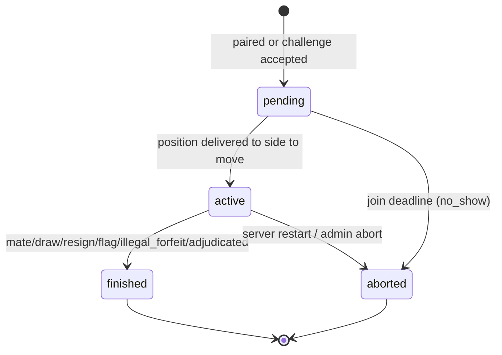

# Chess Arena — Design

**Date:** 2026-08-23
**Revision:** 2 (addresses `agent-reports/2026-08-23-spec-review-systems-design.md`)
**Status:** Approved pending review round 2
**Purpose:** A chess bot competition server for an agentic AI workshop (~20 attendees), doubling as a reference example of an agentic repository.

---

## 1. Goals

1. Attendees write chess bots with Claude's help and watch them climb a live ELO leaderboard.
2. The server is finished infrastructure — attendees consume it, they do not build it.
3. The repository demonstrates Claude best practices: `AGENTS.md`, skills, subagents, spec-driven development, in how it was built and in what it hands attendees.

**Non-goals:** running untrusted attendee code server-side; user accounts beyond a bot token; Swiss/knockout tournaments; mobile UI; multi-process or multi-node deployment.

**Operating envelope.** This design targets ~20 bots, ~10 concurrent games, one process, one day. Every decision below is allowed to assume that. Where a choice would be wrong at 10× scale, that is noted and accepted.

---

## 2. Core decisions

| Decision | Choice | Rationale |
|---|---|---|
| Bot execution | **Client-side** | Removes sandboxing and the untrusted-code threat model entirely. Everything else is affordable because of this. |
| What a bot is | Any program implementing `choose_move` | Server speaks a protocol; engines and agents are equally valid clients. |
| Transport | **Long-polled REST** | `curl`-able, language-agnostic, no WebSocket state machine in the SDK. |
| Time control | **3+2 blitz**, server config | See §11 for the honest limits of this choice. |
| Persistence | **SQLite only** | Postgres capability cut — zero workshop value, forces dialect abstraction. |
| Concurrency | **Single process, single writer, one global mutation lock** | §4. At this scale, correctness beats parallelism and the code stays readable. |
| MCP transport | Streamable HTTP at `/mcp` | One-line attendee setup, no local install. |

---

## 3. Architecture

```
chess_core/          # pure: no I/O, no clock reads, no network. Shared by server AND arena.
  rules.py           # python-chess wrapper: validate, apply, detect termination
  clock.py           # blitz clock arithmetic — time is passed in, never read
  elo.py             # rating math
  matchmaker.py      # pure pairing policy over a pool snapshot
  match.py           # game state machine (pure transitions)

chess_server/
  store/             # SQLite repositories; single writer
  engine/
    runner.py        # applies moves, transitions games, persists
    ticker.py        # THE single supervised background loop
    reference_bots.py# ref-random, ref-greedy, ref-depth2 (in-process, trusted)
    waiters.py       # long-poll waiter registry (one per bot)
  api/               # FastAPI routes, SSE, admin router
  mcp/               # MCP server — an HTTP client of api/, no privileged access

web/                 # dashboard, single page, SSE, no build step
starter-kit/         # what attendees clone; bot.py is the only file they edit
```

`chess_core` purity is load-bearing: it is what makes the clock, Elo and matchmaker testable without fixtures, and it guarantees the offline arena and the live server apply identical rules.

---

## 4. Concurrency contract

**This section is normative. Nothing below may be relaxed for convenience.**

### 4.1 Single writer, one lock

All mutation of `games`, `moves`, `bots.rating`, `rating_history` and `challenges` happens while holding one process-wide `asyncio.Lock` (`store.write_lock`). The ticker and every request handler acquire the same lock. At 20 bots, contention is negligible; per-game locks are forbidden as their bookkeeping outweighs the benefit at this scale.

Reads outside the lock are permitted for display (leaderboard, dashboard snapshot). Any read that informs a write happens **inside** the lock.

### 4.2 Every transition is a conditional UPDATE

The compare-and-swap invariant applies to **every** game-state transition, not only move submission:

```sql
UPDATE games SET status='finished', result=?, termination=?
 WHERE id=? AND status='active' AND ply=?
```

`rowcount` MUST be asserted to be 1. If it is 0, another path already transitioned the game — abandon the work silently. This is the defence against the ticker and a move handler both finalising the same game.

### 4.3 Storage-level backstops

Application logic is not trusted alone:

- `moves`: `PRIMARY KEY (game_id, ply)` — makes a double-move a constraint violation.
- `rating_history`: `UNIQUE (game_id, bot_id)` — makes double rating application impossible.
- `games`: partial unique index enforcing **at most one non-terminal game per bot**:
  `CREATE UNIQUE INDEX one_active_white ON games(white_bot_id) WHERE status IN ('pending','active');` and the same for `black_bot_id`. This closes the challenge-vs-matchmaking double-game race structurally rather than by ordering.
- Index on `games(status)` — the ticker scans it every second.

### 4.4 SQLite execution model

Set at connection open:

```
PRAGMA journal_mode = WAL;
PRAGMA synchronous  = NORMAL;
PRAGMA busy_timeout = 5000;
PRAGMA foreign_keys = ON;
```

One writer connection, used only under `write_lock`; separate read connections for display queries. Blocking `sqlite3` calls run via `anyio.to_thread.run_sync` so a slow fsync cannot stall the event loop and freeze every held long-poll. Never block the loop on a thread join while holding the lock.

Because there is exactly one writer by construction, `SQLITE_BUSY` cannot occur between our own connections; `busy_timeout` covers only external readers (e.g. an operator with `sqlite3` open).

### 4.5 The ticker is supervised

The ticker is the only thing that happens without a request, and its silent death is the highest-blast-radius failure in the system: pairing and flag detection stop while the server continues to look healthy.

- The tick body is wrapped in `try/except Exception`; it logs with the tick number and continues. The loop never exits.
- The process records `last_tick_at` and `consecutive_tick_errors`.
- A supervisor task checks `ticker_task.done()` every 5s and restarts it.
- `GET /health` returns `{last_tick_age_ms, active_games, pending_games, pooled_bots, held_polls, sse_clients, db_writable, consecutive_tick_errors}`.
- The dashboard shows a red banner when `last_tick_age_ms > 5000`. The operator must see the heartbeat from the back of the room.

---

## 5. Data model

All timestamps are UTC wall-clock for display. **All elapsed-time arithmetic uses `time.monotonic_ns()`**, stored separately, so an NTP step or a laptop suspend cannot flag the entire board.

**`bots`**
`id, name UNIQUE, owner, token_hash, role, rating, is_anchor, wins, losses, draws, games_played, controller, control_taken_at, last_poll_at, last_poll_mono, created_at`

**`games`**
`id, white_bot_id, black_bot_id, status, result, termination, fen, ply, white_ms, black_ms, turn_started_at, turn_started_mono, delivered_to_mover, rated, created_at, started_at, ended_at, white_strikes, black_strikes, source`

- `status` ∈ `pending | active | finished | aborted`
- `termination` ∈ `checkmate | stalemate | insufficient | fifty_move | threefold | resignation | flag | illegal_forfeit | adjudicated | no_show | server_restart | admin_abort`
- `source` ∈ `matchmaker | challenge`
- `white_strikes` / `black_strikes` persist illegal-move counts (§8.3)

**`moves`**
`game_id, ply, uci, san, fen_after, server_elapsed_ms, client_reported_ms` — PK `(game_id, ply)`

`server_elapsed_ms` is what the clock is charged (delivery → receipt, includes network). `client_reported_ms` is optional and self-reported by the SDK for diagnostics. Conflating the two would misattribute network latency to bot slowness.

**`rating_history`**
`bot_id, game_id, rating_before, rating_after, delta, ts` — UNIQUE `(game_id, bot_id)`

**`challenges`**
`id, challenger_bot_id, opponent_bot_id, status, created_at, resolved_at, game_id`
`status` ∈ `open | accepted | declined | expired | cancelled`

### 5.1 What sets `rated`

Explicitly, since the review found this undefined:

| Condition | `rated` |
|---|---|
| Either participant has `role='benchmark'` | 0 |
| Both bots share an `owner` | 0 |
| Game ends `no_show`, `server_restart`, `admin_abort` | 0 |
| Game involves an anchor bot (`ref-*`) | 1 — **one-sided**, see §10.3 |
| Otherwise | 1 |

---

## 6. Clock contract

**This section is normative.** The review found the clock start instant undefined; this fixes it.

1. A game is created `status='pending'`, both clocks at `TIME_CONTROL_MS` (default 180 000), `turn_started_at = NULL`, `delivered_to_mover = 0`.
2. **A clock starts on delivery, not on pairing.** `turn_started_mono` is set at the instant the position is written into a poll response for the side to move, and `delivered_to_mover` set to 1. A bot is never charged for time before it has seen the position.
3. **Join deadline.** If a `pending` game is not delivered to the side to move within `JOIN_DEADLINE_MS` (10 000), the ticker voids it: `status='aborted'`, `termination='no_show'`, `rated=0`. The present bot returns to the pool; the absent bot is removed from the pool until it polls again. Neither rating moves.
4. **Move accounting order**, stated explicitly because getting it backwards is silently wrong forever:
   ```
   elapsed   = receive_mono - turn_started_mono
   remaining = remaining - elapsed
   if remaining < 0        -> flag; game over; NO increment
   apply move (may end the game by mate/draw)
   if game continues       -> remaining += INCREMENT_MS
   switch side; new turn_started_mono is set on delivery (step 2)
   ```
5. Flag detection is the ticker's job for the *undelivered* case (a bot that stops polling mid-game). Its resolution is one tick (~1s), which is accepted: at 3+2 a one-second detection lag is immaterial and the alternative is per-game timers.
6. **Pool eligibility is tightened from 60s to 5s** (§9.1). A bot that is not currently there must not be paired.

---

## 7. Game state machine



Only `finished` games with `rated=1` produce `rating_history` rows.

### 7.1 Restart recovery

On startup, before the ticker starts: every `pending` or `active` game is set `status='aborted'`, `termination='server_restart'`, `rated=0`, and an SSE event is emitted. Bots re-poll, get "no game", and are re-paired within a tick.

This costs ~20 seconds of play and zero rating damage, and it makes restarting the server a **safe operator action** during the workshop — which matters, because you will restart it. The alternative (forgiving the gap by resetting `turn_started_mono`) preserves games but adds a window where a genuinely flagged bot is forgiven, for marginal benefit.

Game state is reconstructible from `moves` + `games.fen`; both are written in the same transaction as the transition.

---

## 8. Play protocol

### 8.1 Endpoints

```
POST /bots                     register -> {bot_id, name, token}
GET  /bots/me/turn             long-poll, holds up to 20s
POST /games/{id}/moves         {ply, move, client_reported_ms?}
POST /games/{id}/resign        {ply}
POST /challenges               {opponent}
POST /challenges/{id}/accept   {}
GET  /leaderboard
GET  /games/{id}
GET  /state                    dashboard snapshot (source of truth for SSE clients)
GET  /events                   SSE stream
GET  /health
```

### 8.2 The turn response

The single highest-traffic response in the system, so its shape is nailed down rather than left to twenty independently-guessing clients:

**Game available — `200`:**
```json
{"game_id": 42, "ply": 12, "color": "white", "fen": "...",
 "legal_moves": ["e2e4", "..."], "history_san": ["e4", "e5"],
 "white_ms": 152300, "black_ms": 161100, "controller": "client",
 "poll_token": "..." }
```

**No game — `200` with an explicit null**, never `204`:
```json
{"game_id": null, "reason": "waiting_for_pairing"}
```

`reason` ∈ `waiting_for_pairing | not_your_turn | agent_has_control | paused`. A `204` would force clients to branch on status codes before parsing; a null field is unambiguous in every language and readable in `curl`.

### 8.3 Move submission

- `200` — accepted, returns the resulting state.
- `409` — CAS failure. Body carries `{ply, fen, status}` so the client can resynchronise. **Defined client behaviour: discard the move and re-poll immediately.** Never retry the same move — that is an accidental hot loop.
- `400` — illegal move. Body carries `legal_moves` and the offending FEN. Increments the mover's strike counter; **three strikes in one game forfeits it** (`illegal_forfeit`).
- **Rejected moves do not stop the clock.** Time continues to run from the original delivery instant; a rejected move does not reset `turn_started_mono`. Otherwise an illegal-move loop is a free clock stop.
- `403` — the bot's `controller` does not match the caller (§13.3).
- `429` — rate limited (§8.5).

### 8.4 Long-poll discipline

- Server holds for **20s**; SDK client timeout is **30s**. The skew is deliberate and stated so a client never times out on a healthy hold.
- **One waiter per bot.** A second concurrent poll supersedes the first, which returns immediately with `{"game_id": null, "reason": "superseded"}`. Two live waiters for one bot would allow a position to be delivered twice and the clock to start twice.
- Waiters are `asyncio.Event`-based. Never a thread per waiter.
- `last_poll_at` / `last_poll_mono` are updated **only** by the turn endpoint, never by other requests — pool eligibility depends on it meaning "the bot is actually running".
- Delivery happens under `write_lock`, in the same critical section that sets `turn_started_mono`.

### 8.5 Rate limiting

Per-token token-bucket: 20 requests/second sustained, burst 40. Exceeding returns `429` with actionable prose and `Retry-After`. One attendee's runaway `while True: requests.post(...)` must not degrade the room.

### 8.6 Proxy requirements

If deployed behind a reverse proxy (§2 anticipates conference wifi forcing this): `proxy_buffering off`, `proxy_read_timeout ≥ 60s`. Cloudflare's ~100s cap is compatible with a 20s hold. Both long-polling and SSE fail silently without this.

---

## 9. Matchmaking

### 9.1 Pool eligibility

A bot is eligible for pairing when **all** hold: `role='competitor'`; no `pending`/`active` game; `controller='client'`; not paused; and it has a poll currently held **or** polled within the last 5s.

### 9.2 Pairing policy (pure function in `chess_core/matchmaker.py`)

The widening rating window is cut — it was non-binding within three ticks and added parameters for nothing. Replacement:

1. Sort the eligible pool by `games_played` ascending, then `|rating difference|` ascending.
2. Pair greedily. Skip pairs that are the same `owner`, unless the pool would otherwise produce no games for >30s.
3. Skip an immediate rematch of the previous pairing unless the pool has fewer than 4 bots.
4. **Colour rule, with explicit precedence:** alternate from each bot's last colour. When the two bots' preferences conflict, the bot with fewer games as White gets White; if still tied, the lower `bot_id`. Deterministic, seeded-testable, and pinned in the function's docstring.

Anchor bots (§10.3) are eligible for pairing but are never chosen while two competitors can be paired instead.

---

## 10. Rating

### 10.1 Flat K

**K = 24 for all bots, always.** The two-tier K=32/16 is cut: asymmetric K breaks Elo's zero-sum property, which both allows point injection into a closed 20-bot pool and directly contradicts the property test in §17. "Provisional" survives only as a leaderboard annotation for bots under 10 games — display, never arithmetic.

### 10.2 Application

Ratings are computed and applied in the same critical section that finalises the game, guarded by the `UNIQUE (game_id, bot_id)` constraint. `bots.rating` must always equal the starting rating plus the sum of that bot's `rating_history` deltas; a startup consistency check asserts this and logs loudly on mismatch.

Starting rating: 1200.

### 10.3 Reference bots as fixed anchors

`ref-random` (~800), `ref-greedy` (~1000), `ref-depth2` (~1400) have **fixed ratings that never change**, and are auto-pairable.

Games against them are **rated one-sidedly**: the competitor's rating moves, the anchor's does not. This is deliberate and is standard rating-anchor practice. It does not inflate the pool, because Elo self-limits — as a bot's rating rises above an anchor, its expected score approaches 1 and the delta approaches 0. Farming `ref-greedy` converges to a ceiling near its rating rather than climbing forever.

This also fixes the cold-start problem the review raised: at 09:15 with three attendees registered, the leaderboard is anchored to meaningful values instead of being noise.

### 10.4 Attendee benchmark bots

A bot registered with `role='benchmark'` is unrated, hidden from the leaderboard, excluded from auto-matchmaking, and challengeable. **Games involving a benchmark bot are unrated for both sides** — no exceptions, no one-sided variant. This is what makes self-play sparring safe, and it removes leaderboard farming structurally rather than by policing.

One competitor per owner is enforced at registration; additional bots must be `benchmark`. This closes the "register a second competitor and feed it wins" vector.

---

## 11. Time control — and its honest limits

Default **3+2** (`TIME_CONTROL_MS=180000`, `INCREMENT_MS=2000`), server config.

The review is correct that **3+2 is not viable for an LLM-agent bot.** At ~12s per move the budget is exhausted around move 18: `180 + 2n − 12n < 0 → n ≈ 18`. Revision 1 claimed the increment kept agent bots viable; that claim was wrong and is withdrawn.

Resolution, in order of preference:

1. **Rated play is 3+2 and is for programs.** This is what the leaderboard measures. Stated plainly in the starter kit so nobody is surprised.
2. **Agent bots play unrated exhibitions.** A challenge between two `benchmark`-role bots may specify `time_control='exhibition'` (300+10). Unrated, so a slow agent game cannot distort the ladder, and one such game on the big screen is genuinely good workshop content.
3. A second rated division is **deferred** — two ladders at a 20-person workshop splits an already-thin pool.

The dashboard's featured-game selection holds a game for a minimum of 20s before switching, so fast bots do not make the big screen unwatchable.

---

## 12. Termination rules

Standard results come from `python-chess`: checkmate, stalemate, insufficient material, fifty-move, threefold.

**Adjudication is a flat cap:** at **200 ply** the game ends `termination='adjudicated'`, result **draw**, unconditionally. The material-based "draw if within a pawn" rule from revision 1 is cut — it was bespoke, semantically undefined (which material values? is rook-for-bishop-and-pawn a draw?), untested, and at 3+2 nearly unreachable because someone flags first. A flat draw is one line and needs no argument.

No draw offers. A dead-drawn ending reaches the 200-ply cap or flags; at blitz that is acceptable and it avoids an entire negotiation protocol.

---

## 13. MCP surface

### 13.1 Identity

The review is right that this is the most likely 2pm failure. Specified end to end:

- The attendee's `.mcp.json` carries `"headers": {"Authorization": "Bearer <token>"}`.
- The MCP server forwards that header verbatim to the HTTP API. It has **no default token and no privileged path** — with no token, every tool returns the same actionable error as the API.
- `register_bot` returns a token **into the conversation transcript**. This is documented plainly: the token is not a secret from the attendee's own Claude, it is a secret from other attendees. The starter kit's `run.py --register` is the primary path; the MCP tool exists for attendees who never open a terminal.
- CORS configured for the dashboard origin; `Mcp-Session-Id` added to `Access-Control-Expose-Headers`.

### 13.2 Tools

**Observe:** `get_leaderboard()`, `get_my_bot()`, `get_game(game_id?)`, `analyze_game(game_id)`
**Act:** `register_bot(name, owner, role)`, `challenge(opponent)`, `make_move(game_id, ply, move)`, `get_legal_moves(game_id)`, `take_control()`, `release_control()`

`get_game()` defaults to the caller's current game and returns an **ASCII board** plus FEN, SAN history, clocks and turn. Claude reasons better over a board it can see than a JSON blob, at a fraction of the tokens.

`analyze_game` returns **PGN, per-move `server_elapsed_ms`, and explicit markers for flag / illegal-move strikes / forfeit**. The "eval swing" from revision 1 is cut: it implied an engine dependency (Stockfish binary, Docker layer, per-move analysis cost, a new workshop-morning failure mode) that appeared nowhere else in the spec. Timing and strike markers answer the overwhelming majority of real losses, which are timeouts and shallow-search blunders.

Errors are actionable prose, never bare codes. Mutating tools carry `destructiveHint`; read-only tools `readOnlyHint`.

### 13.3 Control handoff, made atomic

Revision 1's handoff had a race that defeated its own purpose. Fixed:

- `controller` is **per-bot**, set under `write_lock`.
- `take_control()` sets `controller='agent'` **and wakes any held poll for that bot**, which returns `{"game_id": null, "reason": "agent_has_control"}`. There is no window in which the SDK still believes it may move.
- The move endpoint checks `controller` inside the same critical section as the CAS and returns `403` on mismatch. Authorisation is not a pre-check.
- Auto-release after 30s of agent inactivity, so an abandoned `take_control` does not strand a bot for the rest of the day.
- The SDK logs `Control taken by agent; waiting.` and idles rather than spewing errors.

---

## 14. Dashboard and SSE

One app, two modes via a toggle (a deliberate product choice, retained):

- **Big Screen** — one featured game rendered large, leaderboard rail, results ticker. Readable from the back of the room.
- **My Bot** — leaderboard, live game grid, personal panel with rating sparkline and recent results.

Rated server games render **green**, local/unrated **amber**. Nobody should mistake a practice win for a ranked one.

**SSE hardening:**

- `GET /state` returns a full snapshot and is the source of truth. `/events` carries deltas.
- Each event has an `id:`; clients send `Last-Event-ID` on reconnect. On any gap the client refetches `/state` rather than trusting a partial stream.
- Per-client bounded queue (256 events), **drop-oldest**; a dropped client is flagged and refetches `/state`. A stalled browser tab must never apply backpressure to the game loop.
- 15s heartbeat comment frames to keep proxies from closing idle streams.
- Event payloads carry **no tokens, no owner identifiers**. Bot id and name only.
- Clock values plus `turn_started_at` are included so the browser can tick locally between events; otherwise clocks appear frozen.

---

## 15. Admin and observability

The operator needs a surface. Behind `ADMIN_TOKEN`, never exposed to attendees:

```
POST /admin/games/{id}/abort       stuck game -> aborted, unrated
POST /admin/matchmaking/pause      and /resume
POST /admin/bots/{name}/token      re-issue (an attendee who loses their token
                                   otherwise re-registers and distorts the ladder)
POST /admin/reset                  wipe games/ratings, keep bots — for a dry run
GET  /admin/consistency            assert ratings == sum(rating_history)
```

Structured logging: one line per game start/end with ids, termination and deltas. Tokens are never logged, in any path.

---

## 16. Local arena

```bash
python arena.py --bots bot.py baseline.py ref_greedy.py --games 100 --seed 7
```

Runs bots against each other offline through `chess_core`, printing a local ELO table plus:

- time per move (mean / p95) and **flag count** — the most common way a first bot loses
- illegal-move attempts with the offending position
- head-to-head win rates, PGN export, `--replay <game>` for ASCII stepping

**Opening randomisation is mandatory.** Two deterministic bots otherwise replay one identical game, making "100 games" a statistical illusion that looks like it is working. Games start from a random opening drawn from a small book, seeded for reproducibility.

The arena runs the same clock code as the server, so a bot that flags locally will flag live.

---

## 17. Testing

- **`chess_core`** — direct unit tests, no fixtures, no mocks. Elo gets a property test asserting the exchange is **zero-sum and symmetric** (now true, since K is flat — this was contradictory in revision 1).
- **Clock** — table-driven tests over the §6 ordering, including flag-on-exact-zero, increment-not-granted-on-flag, and rejected-move-does-not-reset.
- **Matchmaker** — seeded pool snapshots; colour-precedence and same-owner rules pinned.
- **Concurrency** — a test that fires a move submission and a ticker flag pass at the same instant and asserts exactly one `rating_history` row and one terminal transition. This is the test that would have caught the revision 1 defect.
- **API** — in-process scripted **fake bot harness** playing complete games over the real endpoints.
- **Failure paths first:** illegal-move strikes, flag-fall, mid-game disconnect, CAS conflict, control handoff, no-show, server restart mid-game, superseded poll.

---

## 18. Agentic repository layout

**Build-time agents** (`.claude/agents/`)

| Agent | Expertise | Owns |
|---|---|---|
| `chess-domain-engineer` | python-chess, clock semantics, Elo, adjudication | `chess_core/`, strict TDD |
| `server-engineer` | FastAPI, SQLite, async, long-polling, auth, CAS, concurrency | `store/`, `engine/`, `api/` |
| `mcp-engineer` | MCP spec, FastMCP, tool-description ergonomics | `mcp/` |
| `dashboard-engineer` | HTML/CSS/JS, SSE, board rendering, visual design | `web/` |
| `workshop-author` | Pedagogy, Claude customization formats, writing for novices | `AGENTS.md`, skills, starter-kit docs |
| `spec-reviewer` | Diffs vs spec; security, simplicity, YAGNI | Read-only, everything |

`mcp-engineer` and `server-engineer` are not redundant: one designs for HTTP clients (status codes, idempotency, wire efficiency), the other for a language model (prose over JSON, self-explaining errors, names that survive a crowded namespace).

`chess-domain-engineer` is isolated because it is the only place where being wrong is *silent*.

**Attendee-facing skills** (`starter-kit/.claude/skills/`)

- `chess-engine-techniques` — **the one that must exist.** Material values, piece-square tables, alpha-beta, move ordering, quiescence, and time management for a 3+2 clock. Concrete and codeable; "consider king safety" is useless to a non-player. This is what unblocks someone who has never played chess.
- `writing-a-chess-bot` — the iterate loop, what to edit, how to deploy
- `benchmarking-a-bot` — sample sizes, the `ref-*` ladder, reading time/flag stats, the bar for deploying
- `diagnosing-bot-losses` — reading `analyze_game`, common failure patterns

**Attendee-facing agents** — only where isolation pays for itself. `eval-tuner` (parameter sweeps, 12 configs × 100 games → one config) and the `/improve-bot` command are **stretch goals**, built only if the server ships early.

The skill-vs-subagent split is itself teaching material: **subagents isolate noisy work; skills inject knowledge into work you are already doing.** Corollary: make your tools return summaries and you need fewer subagents — reaching for a subagent is often a workaround for a CLI that dumps too much.

---

## 19. Phasing

1. `chess_core` — rules, clock (§6), Elo, matchmaker, match state machine
2. `arena.py` + starter-kit `bot.py` + baseline — **a playable competition with no server at all**
3. Server — store (§4), API, supervised ticker, reference bots, fake-bot harness
4. `chess_client` SDK — the loop attendees actually run; **the whole loop closes here**
5. MCP server
6. Dashboard + SSE + `/health` banner
7. Admin surface
8. Claude layer — `AGENTS.md`, skills, agents

Phases 2 and 4 are genuine stopping points if time runs short.

---

## 20. Cut and deferred

**Cut** (was in revision 1): Postgres capability; `analyze_game` eval swing; widening rating window; two-tier K-factor; 150-move material adjudication; the separate 60s disconnect rule.

**Deferred:** Swiss tournaments; a second rated division for agent bots; bot code upload with sandboxing; spectator chat; cross-workshop persistent leaderboards; `eval-tuner` and `/improve-bot`.

**Known accepted limits:** flag detection resolution is one tick (~1s); a single process means a crash loses ~20s of play; SQLite and the global lock would be wrong at 10× scale, and that is fine.
